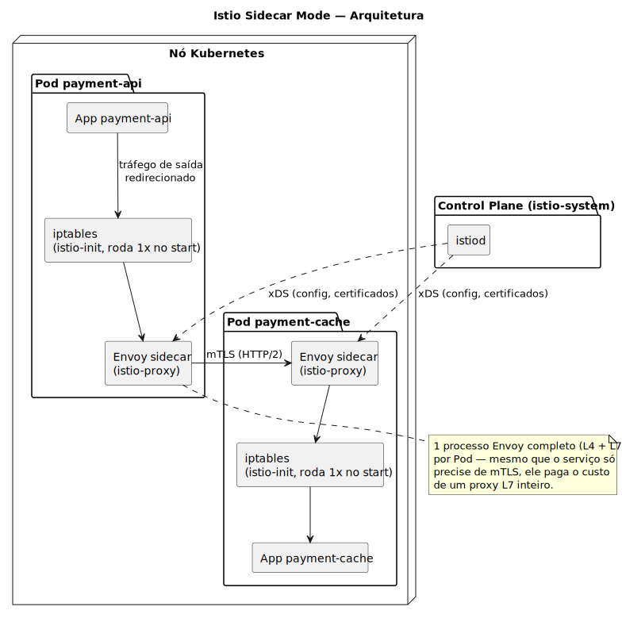
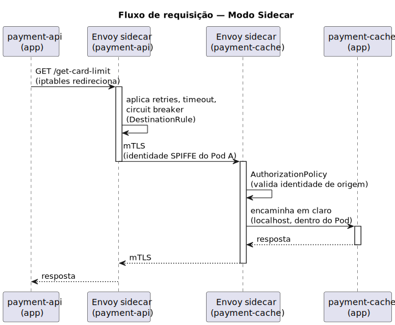
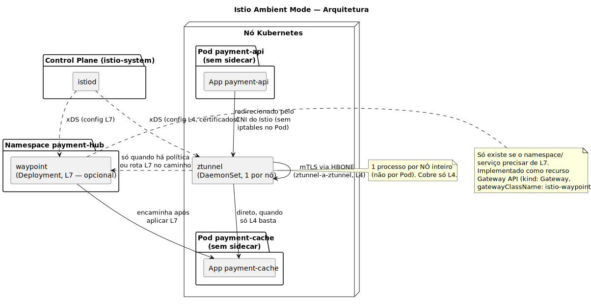
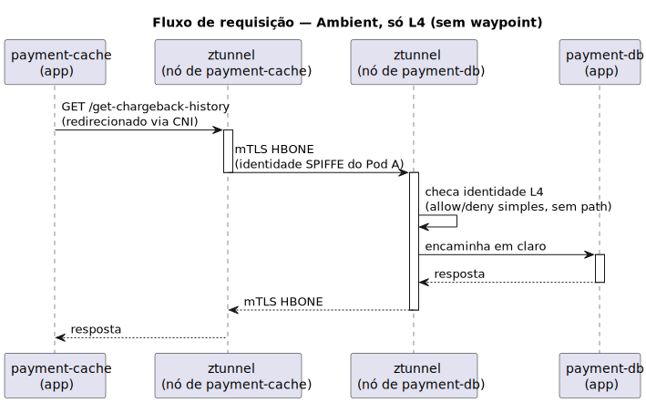
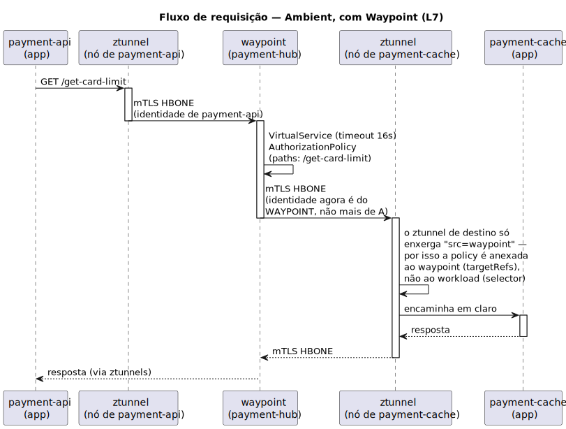
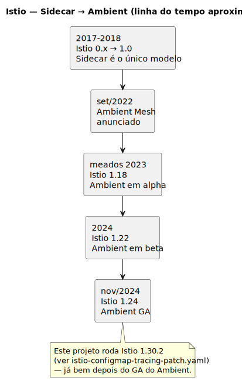

# Istio Sidecar → Ambient Mode: evolução e mudança de paradigma

> Os diagramas abaixo são renderizados a partir das fontes [PlantUML](https://plantuml.com/) em
> [docs/](docs/) — edite o `.puml` correspondente e rode `plantuml -tsvg docs/*.puml` pra
> atualizar o SVG. Este projeto ([payment-hub](istio/)) já roda em **Ambient Mode** — os
> diagramas de L7 usam o caso real `payment-api → payment-cache` como exemplo, não um cenário
> genérico.

## Índice

1. [O problema que o service mesh resolve](#1-o-problema-que-o-service-mesh-resolve)
2. [Sidecar Mode: o modelo clássico](#2-sidecar-mode-o-modelo-clássico)
3. [Ambient Mode: o novo modelo](#3-ambient-mode-o-novo-modelo)
4. [Comparação lado a lado](#4-comparação-lado-a-lado)
5. [Linha do tempo](#5-linha-do-tempo)
6. [Este projeto como exemplo prático](#6-este-projeto-como-exemplo-prático)
7. [Quando escolher qual](#7-quando-escolher-qual)
8. [Referências](#8-referências)

---

## 1. O problema que o service mesh resolve

Antes de comparar os dois modos, vale lembrar **por que** um service mesh existe: mTLS entre
serviços, retries, timeouts, circuit breaking, roteamento por path, autorização por identidade e
observabilidade (tracing/métricas) são requisitos transversais que, sem um mesh, cada time
reimplementa dentro do próprio código de aplicação — em cada linguagem, de novo, com bugs
diferentes.

O Istio resolve isso tirando essa responsabilidade do código da aplicação e colocando num proxy
(Envoy) que fica no caminho de rede. A pergunta que Sidecar e Ambient respondem de formas
diferentes é: **onde exatamente esse proxy deve rodar?**

---

## 2. Sidecar Mode: o modelo clássico

Desde o lançamento original do Istio, o modelo padrão foi: **um proxy Envoy por Pod**, injetado
como um container adicional (`istio-proxy`) dentro do mesmo Pod da aplicação. Um init-container
(`istio-init`) configura regras de `iptables` *dentro do namespace de rede do Pod* pra
redirecionar todo o tráfego de entrada e saída pro Envoy local, de forma transparente pra
aplicação.

*Fonte: [docs/sidecar-architecture.puml](docs/sidecar-architecture.puml)*

### 2.1 Fluxo de uma requisição no modo Sidecar

*Fonte: [docs/sidecar-sequence.puml](docs/sidecar-sequence.puml)*

### 2.2 Limitações que motivaram o Ambient Mode

- **Overhead de recursos por Pod.** Cada Pod ganha um Envoy completo (CPU/memória reservados),
  mesmo que o serviço seja trivial e só precise de mTLS. Em clusters com centenas/milhares de
  Pods, isso vira um custo fixo relevante.
- **Acoplamento de ciclo de vida.** Atualizar a versão do proxy geralmente exige reiniciar
  (rolling restart) todos os Pods da malha — o Envoy não é um processo independente do Pod da
  aplicação.
- **Injeção via webhook é frágil.** Se o *mutating webhook* de injeção falhar ou não disparar (ex.:
  Pod criado antes do webhook estar pronto), o Pod sobe **sem** sidecar e sem aviso óbvio — ele
  simplesmente não participa da malha.
- **Ordem de inicialização/encerramento.** Historicamente, se o container da aplicação terminava
  antes do sidecar terminar de iniciar, ou terminava depois do sidecar já ter saído, requisições
  falhavam — sintoma clássico de "Job do Kubernetes preso" ou "sidecar ainda não pronto".
- **Tudo ou nada entre L4 e L7.** Não existe meio-termo: ou o Pod tem um Envoy completo (L4+L7),
  ou não tem proxy nenhum. Um serviço que só quer mTLS paga o mesmo preço de quem usa roteamento
  HTTP avançado.

---

## 3. Ambient Mode: o novo modelo

O Ambient Mode parte de uma pergunta diferente: **a maioria dos serviços só precisa de L4**
(mTLS, identidade, allow/deny simples). Só uma minoria precisa de **L7** (roteamento por path,
retries por rota, `AuthorizationPolicy` com `paths`). Então por que forçar todo mundo a rodar um
proxy L7 completo?

A resposta do Ambient é separar isso em dois componentes **sem nenhum container extra no Pod da
aplicação**:

- **ztunnel** ("zero trust tunnel") — `DaemonSet`, **um por nó**, escrito em Rust. Cobre só L4:
  mTLS automático (via um túnel HTTP/2 chamado **HBONE**), identidade SPIFFE, e
  `AuthorizationPolicy` sem `paths`/`hosts` (L4 puro).
- **waypoint** — `Deployment` Envoy, **opcional**, um por namespace (ou por ServiceAccount).
  Só existe se alguém no namespace realmente precisar de L7: `VirtualService`, `DestinationRule`,
  `AuthorizationPolicy` com `paths`. Namespaces que só querem mTLS **não têm waypoint nenhum**.

O redirecionamento de tráfego deixa de ser por `iptables` dentro de cada Pod e passa a ser feito
pelo plugin de CNI do Istio, a nível de **nó** — não há mais init-container `istio-init` por Pod.

*Fonte: [docs/ambient-architecture.puml](docs/ambient-architecture.puml)*

### 3.1 Fluxo L4-only (sem waypoint no caminho)

Quando nenhum `VirtualService`/`AuthorizationPolicy` por path existe entre dois serviços, o
tráfego nunca passa por um waypoint — vai direto ztunnel-a-ztunnel:

*Fonte: [docs/ambient-sequence-l4.puml](docs/ambient-sequence-l4.puml)*

### 3.2 Fluxo L4+L7 (com waypoint) — caso real deste projeto

Este é exatamente o caminho `payment-api → payment-cache` deste projeto: existe um
`VirtualService` com timeout dedicado e uma `AuthorizationPolicy` restrita por `paths` em
[istio/payment-cache.yaml](istio/payment-cache.yaml), então o tráfego **precisa** passar pelo
waypoint do namespace `payment-hub`.

*Fonte: [docs/ambient-sequence-l7.puml](docs/ambient-sequence-l7.puml)*

> Essa troca de identidade no último hop (`ZB` vê o **waypoint** como origem, não o Pod
> `payment-api` original) é a razão prática pela qual toda `AuthorizationPolicy` deste projeto
> usa `targetRefs` apontando pro waypoint em vez de `selector` no workload de destino — o
> comentário em [istio/payment-cache.yaml](istio/payment-cache.yaml) documenta isso.

### 3.3 O que se ganha

- **Footprint proporcional a nós, não a Pods.** Um ztunnel por nó cobre dezenas de Pods; um
  waypoint só existe onde há demanda de L7.
- **Adoção incremental.** Dá pra ligar mTLS (`ztunnel`) num namespace inteiro e só aplicar
  waypoint pros serviços que realmente precisam de roteamento/autorização L7 —
  `istioctl waypoint apply` é um passo separado e opcional.
- **Menor acoplamento de ciclo de vida.** Atualizar `ztunnel`/`waypoint` não exige reiniciar os
  Pods da aplicação — eles são processos independentes.
- **Degradação graciosa.** Se o waypoint cair, o tráfego L4 (mTLS via ztunnel) continua
  funcionando; só as regras L7 daquele namespace ficam indisponíveis, não a malha inteira.

### 3.4 O que se perde / cuidados

- **Mais uma camada conceitual.** Entender "quando o tráfego passa por waypoint" exige raciocinar
  sobre quais recursos (VirtualService, AuthorizationPolicy com `paths`) existem pro par
  origem/destino — não é tão direto quanto "todo Pod tem um Envoy".
- **Maturidade.** Ambient GA é bem mais recente que Sidecar (que já roda em produção desde os
  primeiros releases do Istio) — menos anos de "battle testing", menos material/ferramental de
  terceiros validado especificamente pra esse modo.
- **Dependência de recursos do nó.** Ambient usa eBPF/HBONE mais fortemente que o modelo Sidecar
  clássico — nem todo ambiente gerenciado suporta isso de forma idêntica.
- **Debug muda de mental model.** Como visto no [JAEGER-SETUP.md](JAEGER-SETUP.md), em Ambient só
  ingressgateway e waypoint geram spans de tracing — os apps não aparecem como "serviço" próprio
  no Jaeger, diferente do Sidecar onde cada Pod teria seu próprio Envoy gerando spans.

---

## 4. Comparação lado a lado

| Aspecto | Sidecar | Ambient |
|---|---|---|
| Proxy roda em | Cada Pod (container extra) | ztunnel: por nó · waypoint: por namespace (opcional) |
| Quem paga custo de L7 | Todos os Pods, sempre | Só quem tem VirtualService/AuthorizationPolicy L7 |
| Redirecionamento de tráfego | `iptables` por Pod (`istio-init`) | CNI a nível de nó, sem init-container por Pod |
| Reinício do Pod ao atualizar proxy | Geralmente sim | Não — ztunnel/waypoint são independentes |
| Falha silenciosa de onboarding | Webhook de injeção pode falhar sem aviso | Label de namespace habilita ztunnel de forma mais previsível |
| Granularidade de L4 vs L7 | Inexistente (sempre os dois juntos) | Explícita (L4 sempre; L7 só com waypoint) |
| Nomes de serviço no tracing | Cada Pod aparece individualmente | Só ingressgateway/waypoint aparecem como "serviço" |
| Maturidade | GA desde os primeiros releases do Istio | GA desde Istio 1.24 (nov/2024) |

---

## 5. Linha do tempo

*Fonte: [docs/istio-timeline.puml](docs/istio-timeline.puml)*

> Datas/versões de graduação de feature são aproximadas — confira o changelog oficial do Istio
> se for citar isso formalmente.

---

## 6. Este projeto como exemplo prático

O `payment-hub` já roda em Ambient Mode, e cada peça teórica acima tem um artefato correspondente
no repositório:

| Conceito | Onde está neste projeto |
|---|---|
| ztunnel (DaemonSet, L4) | Cobre `payment-hub` inteiro; garante o mTLS `STRICT` de [istio/mesh.yaml](istio/mesh.yaml) mesmo sem waypoint |
| waypoint (Deployment, L7) | `kubectl get pods -n payment-hub` mostra o Pod `waypoint-...`; aplicado via `istioctl waypoint apply -n payment-hub --enroll-namespace` |
| AuthorizationPolicy anexada ao waypoint, não ao workload | Todas as policies em `istio/*.yaml` usam `targetRefs: kind: Gateway, name: waypoint` — nunca `selector` |
| Degradação L4-only | `payment-db`/`payment-queue` não têm VirtualService de saída própria — só recebem, então o mTLS STRICT continua garantido pelo ztunnel independente do waypoint |
| Granularidade L7 real | `istio/payment-cache.yaml` tem `AuthorizationPolicy` restrita por `paths: ["/check-transaction-history", "/get-card-limit"]` — só possível porque existe waypoint no caminho |
| Tracing muda com o modo | [JAEGER-SETUP.md](JAEGER-SETUP.md) documenta que só `istio-ingressgateway.istio-system` e `waypoint.payment-hub` aparecem como serviços no Jaeger — os 4 apps Go não têm proxy próprio gerando spans |

---

## 7. Quando escolher qual

**Ambient tende a fazer mais sentido quando:**
- O cluster tem muitos serviços "simples" que só precisam de mTLS (a maioria dos casos reais).
- Reduzir footprint de recursos/operacional é uma prioridade.
- O projeto está começando do zero (sem automação legada em cima do modelo Sidecar).

**Sidecar ainda pode ser a escolha certa quando:**
- Já existe produção madura, com anos de automação/observabilidade construídas especificamente
  em cima do modelo Sidecar (dashboards, alertas, runbooks assumindo 1 Envoy por Pod).
- Há dependência de filtros WASM ou extensões L7 customizadas *por Pod específico*, algo mais
  direto no modelo Sidecar do que num waypoint compartilhado.
- O ecossistema de ferramentas de terceiros em uso ainda não tem suporte validado pra Ambient.

---

## 8. Referências

- Documentação oficial do Ambient Mode: `https://istio.io/latest/docs/ambient/overview/`
- Anúncio original do Ambient Mesh (2022): `https://istio.io/latest/blog/2022/introducing-ambient-mesh/`
- PlantUML (para renderizar os diagramas deste arquivo): `https://plantuml.com/`
- Fontes editáveis dos 6 diagramas: [docs/](docs/) — `plantuml -tsvg docs/*.puml` regenera os
  SVGs após qualquer alteração.
